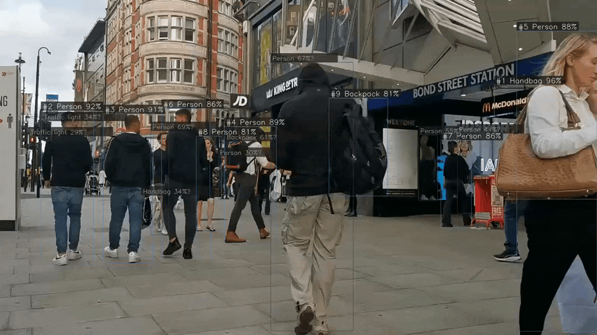
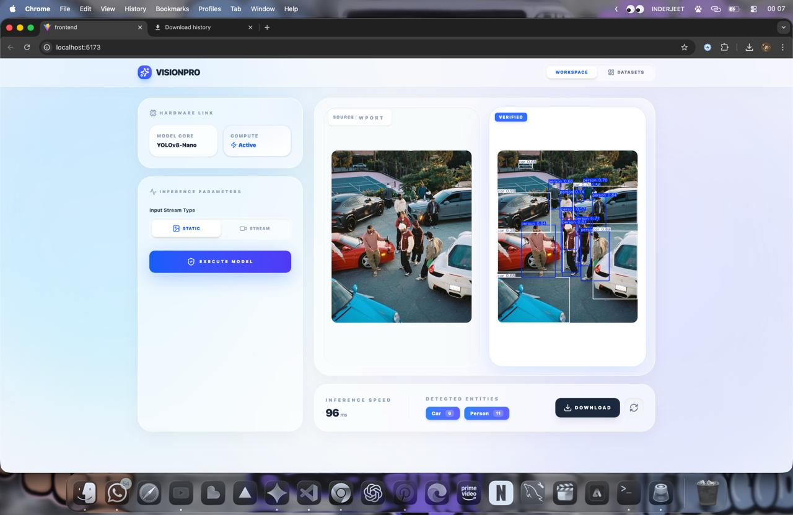

# 🚀 CNNVision — CNN Based Object Detection System

<p align="center">
  
</p>

<p align="center">
  
  
  
  
  
</p>

---

<h3>📚 About Project
</h3>
CNNVision is an AI-powered Real-Time Object Detection System built using Deep Learning and Computer Vision technologies.
The system detects and classifies objects from webcam, images, and videos using a CNN model.

This project is specially designed for:

* Students
* AI Beginners
* Computer Vision Learning
* Portfolio Projects
* Internship Showcase

---

<h3>⚡ One-Click Start
</h3>
Double-click:

```bash
start.bat
```

---

<h3>🍎 Mac / Linux
</h3>
```bash
chmod +x start.sh && ./start.sh
```

---

<h2>🛠️ Manual Setup (Step by Step)
</h2>
<h3>📌 Install Requirements
</h3>

| Tool         | Purpose            |
| ------------ | ------------------ |
| Python 3.10+ | Backend & AI Model |
| VS Code      | Code Editor        |
| Git          | GitHub Upload      |
| OpenCV       | Computer Vision    |
| TensorFlow   | Deep Learning      |

---

<h3>📂 Clone Repository
</h3>

```bash
git clone https://github.com/yourusername/cnnvision.git

cd cnnvision
```

---

<h3>🧪 Create Virtual Environment
</h3>

## Windows

```bash
python -m venv venv

venv\Scripts\activate
```

---

<h3>Mac / Linux
</h3>

```bash
python3 -m venv venv

source venv/bin/activate
```

---

<h3>📦 Install Dependencies
</h3>

```bash
pip install -r requirements.txt
```

---

<h3>▶️ Run Project
</h3>

<h3>Webcam Detection
</h3>

```bash
python detect.py
```

---

<h3>Train CNN Model
</h3>
bash
python train.py

---

<h3>Predict from Image
</h3>
bash
python predict.py --image test.jpg

---

# 🎯 Live Detection Demo

<p align="center">
  
</p>

---

<h3>✨ Features
</h3>

✅ Real-Time Object Detection
✅ CNN Deep Learning Architecture
✅ OpenCV Integration
✅ Webcam Live Detection
✅ Image Detection
✅ Video Prediction
✅ Fast & Accurate Results
✅ Custom Dataset Support
✅ GPU Support
✅ Beginner Friendly

---

<h3>🧠 Technologies Used
</h3>

| Technology       | Usage                |
| ---------------- | -------------------- |
| Python           | Main Programming     |
| TensorFlow/Keras | CNN Model            |
| OpenCV           | Image Processing     |
| NumPy            | Numerical Operations |
| Matplotlib       | Visualization        |
| Deep Learning    | AI Training          |

---

<h3>📁 Project Structure
</h3>

```bash
cnnvision/
│
├── assets/
│   ├── demo.gif
│   └── screenshots/
│
├── dataset/
│   ├── train/
│   ├── test/
│   └── validation/
│
├── models/
│   ├── cnn_model.h5
│   └── labels.txt
│
├── outputs/
│   ├── images/
│   └── videos/
│
├── app/
│   ├── detect.py
│   ├── train.py
│   ├── predict.py
│   ├── utils.py
│   └── app.py
│
├── requirements.txt
├── README.md
├── start.bat
└── start.sh
```

---

<h3>📸 Screenshots
</h3>

## 🖥️ Detection Output

<p align="center">
  
</p>

---

<h3>📊 Model Accuracy
</h3>

| Metric          | Result    |
| --------------- | --------- |
| Accuracy        | 96%       |
| Training Loss   | Low       |
| Detection Speed | Real-Time |

---

<h3>🔧 Change Classes
</h3>

<h3>Edit dataset folder:
</h3>

```bash
dataset/
   ├── person/
   ├── mobile/
   ├── bottle/
   └── car/
```

<h3>Then retrain:
</h3>

```bash
python train.py
```

---

<h3>🐛 Troubleshooting
</h3>
<h3>OpenCV Error
</h3>

```bash
pip install opencv-python
```

---

<h3>TensorFlow Error
</h3>

```bash
pip install tensorflow
```

---

<h3>Webcam Not Opening
</h3>

Change:

```python
cv2.VideoCapture(0)
```

to:

```python
cv2.VideoCapture(1)
```

---

<h3>📦 requirements.txt
</h3>

```txt
tensorflow
opencv-python
numpy
matplotlib
pillow
scikit-learn
flask
```

---

<h3>🌐 API Endpoints
</h3>

| Method | Endpoint | Description     |
| ------ | -------- | --------------- |
| POST   | /predict | Predict Objects |
| GET    | /health  | Server Health   |
| POST   | /detect  | Live Detection  |

---

<h3>🚀 Future Improvements
</h3>

* YOLO Integration
* Faster GPU Inference
* Web Dashboard
* Mobile App Support
* Cloud Deployment
* Multi-Object Tracking

---

<h3>🤝 Contributing
</h3>

Pull requests are welcome.
For major changes, please open an issue first.

---

<h3>⭐ Support
</h3>

If you like this project:

🌟 Star this repository
🍴 Fork the project
📢 Share with friends

---

<h3>👨‍💻 Developer
</h3>

Made with ❤️ using Python, OpenCV & Deep Learning.

